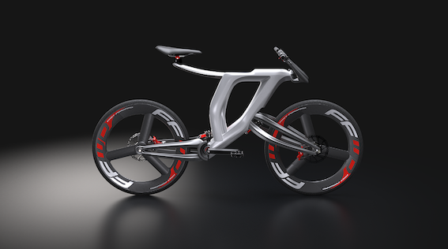

## PersonalCycling
The NAICS of our company is 336991 - Motorcycle, Bicycle, and Parts Manufacturing.

We intend to produce and offer customized products or items related to cycling using a 3D printer.

We need workers to carry out the following activities:

Engineering --> Research and design the product.

Operations --> Product development, selling, distribution, setting and repairing the printer.

Management, finance and human resources.

### Job Posting:

